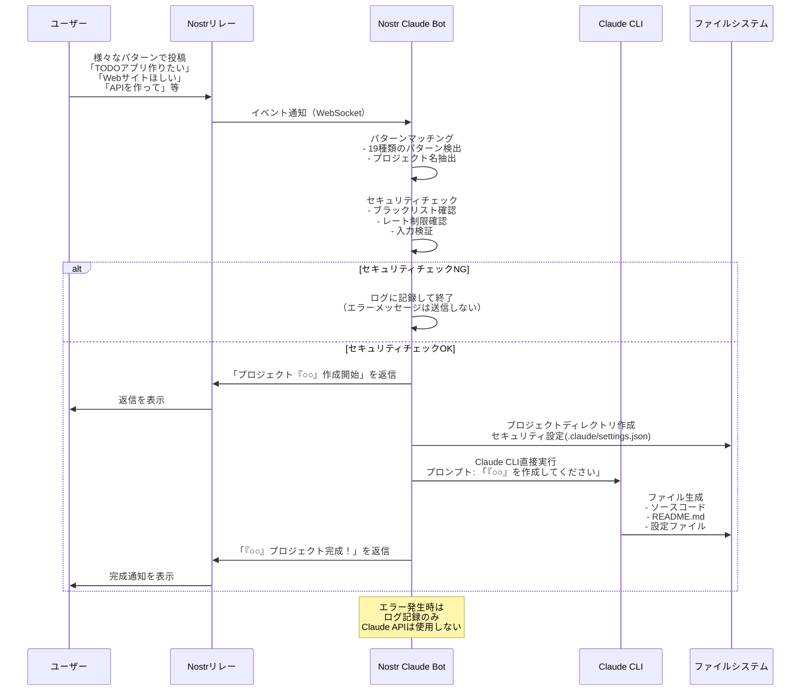

# Nostr Claude Bot

Nostrで「○○がほしいなぁ」みたいにつぶやいている人を見つけて勝手にClaude Codeで製作し出すbotです。
ギャグで作っただけで、実際はこんなものを起動するとシステム壊されたり違法なもの作られたり変な依頼が来る可能性があるのでまぁ基本使わない方がいいです。

## known bugs
現状、claude code の認証に失敗しているのでプロジェクトが始まりません。
claude-auth で認証して nostr-claude-bot-full に認証ファイルをコピーして動かすらしいです。なんで

## 機能

- Nostrのリレーを監視し、プロジェクト作成要求を検出
- Claude CLIを実行してプロジェクトを自動生成
- 生成結果をNostrで返信

## 対応メッセージパターン

以下のようなメッセージに反応してプロジェクトを作成します：

- 「TODOアプリ作りたい」
- 「Webサイトほしい」  
- 「チャットボット欲しい」
- 「ゲームが欲しい」
- 「APIを作って」
- 「ダッシュボード作成して」
- 「システムを開発して」
- 「ツールを実装して」
- 「ライブラリが必要」
- 「スクリプトを生成して」
- 「プラグインをお願い」

その他、○○の部分にプロジェクト名を入れた様々な表現に対応しています。

## セットアップ

### 1. リポジトリのクローン
```bash
git clone https://github.com/yourusername/nostr-claude-bot.git
cd nostr-claude-bot
```

### 2. 環境変数の設定
`.env.example`を`.env`にコピーして必要な情報を設定：
```bash
cp .env.example .env
nano .env  # 設定を編集
```

### 3. Docker セットアップ（推奨）

#### 3.1 Docker権限の設定（初回のみ）
```bash
# ユーザーをdockerグループに追加
sudo usermod -aG docker $USER

# 新しいグループ設定を適用
newgrp docker

# 確認
groups $USER
# 出力に 'docker' が含まれていればOK
```

⚠️ **セキュリティ上の注意**: dockerグループのメンバーは実質的にroot権限を持ちます。開発環境でのみ使用し、本番環境では慎重に検討してください。

#### 3.2 Botのセットアップ
```bash
./setup-docker.sh
```

このスクリプトは以下を自動で行います：
- Dockerグループの設定確認・自動設定
- Dockerサービスの開始
- .envファイルの確認
- Docker イメージのビルド
- **最小限のマウント**で安全なコンテナでの Bot 起動

## 使い方

### 2. 監視とメンテナンス

```bash
# 定期的なログ確認
docker logs -f nostr-claude-bot-simple

# コンテナ再起動（必要時）
docker restart nostr-claude-bot-simple
```

### 3. Claude CLI統合（オプション）

実際のプロジェクト生成機能が必要な場合：
```bash
./run-with-claude.sh
```

### 4. 設定変更

`.env`ファイルを編集後：
```bash
docker restart nostr-claude-bot-simple
```

## 🔧 便利なコマンド

```bash
# 停止
docker stop nostr-claude-bot-simple

# 完全リセット
./cleanup-docker.sh
./setup-docker.sh
```

## 🛡️ セキュリティについて

### Docker権限について
- **dockerグループ**: 実質的にroot権限を持つため注意が必要
- **開発環境**: 個人の開発マシンでは一般的に安全
- **本番環境**: より慎重な権限管理が必要

### セキュリティ対策
本プロジェクトでは以下のセキュリティ対策を実装しています：

#### 1. 最小限のマウント
```bash
# 必要最小限のファイルのみマウント
-v "$(pwd)/.env:/app/.env:ro"  # 設定ファイル（読み取り専用）
```

#### 2. ホストファイルシステムの保護
- `generated-projects/` マウントを削除 → ホストファイルシステムへの書き込み不可
- `logs/` マウントを削除 → ログは `docker logs` コマンドで確認
- ホストの重要なディレクトリ（`/etc`, `/root`, `/home`等）にアクセス不可

#### 3. 読み取り専用設定
- `.env` ファイルは読み取り専用（`:ro`）でマウント
- 設定ファイルの改ざんを防止

### 代替案（本番環境向け）
```bash
# 1. sudoを使い続ける
sudo docker logs -f nostr-claude-bot-simple

# 2. Docker Rootless Mode
dockerd-rootless-setuptool.sh install

# 3. 専用サービスアカウント
sudo useradd -r -s /bin/false docker-service
```

### Nostrでの使用方法

1. **プロジェクト作成リクエスト**
   Nostrクライアント（Damus、Amethyst等）で以下のように投稿：
   ```
   TODOアプリ作りたい
   ```
   
2. **Botからの返信**
   Botが自動的に返信します：
   ```
   プロジェクト「TODOアプリ」を作成開始します！
   ```
   
3. **完成通知**
   プロジェクト生成が完了すると結果が返信されます：
   ```
   プロジェクト「TODOアプリ」の作成が完了しました！
   
   パス: ./generated-projects/TODOアプリ_2024-01-15T...
   
   プロジェクトが作成されました:
   ```

### 処理フロー図



### 対応するプロジェクトの例

- 「TODOアプリ作りたい」
- 「Webサイトほしい」
- 「チャットボット欲しい」
- 「ゲームが欲しい」
- 「APIを作って」
- 「ダッシュボード作成して」
- 「システムを開発して」
- 「ツールを実装して」
- 「ライブラリが必要」
- 「スクリプトを生成して」
- 「プラグインをお願い」
- 「負けず嫌いなのでキレられるとキレ返しちゃうからお願いだからキレないで」（実例😄）

## Nostrアクセスの仕組み

### Botが行うNostrアクセスの種類

#### 1. リレーへの接続（WebSocket接続）
- **目的**: リアルタイムでメッセージを受信するため
- **接続先**: 環境変数で指定されたリレー（自前のリレーまたは許可を得たリレーを推奨）
- **接続方法**: WebSocketプロトコルで常時接続を維持
- **負荷**: 最小限（通常のNostrクライアントと同等）

#### 2. メッセージの購読（Subscription）
- **購読内容**: 
  - kind: 1（通常のテキストノート）
  - since: Bot起動時からの新規メッセージのみ
- **フィルタリング**: 「○○作りたい」パターンのメッセージのみ処理
- **リレーへの負荷**: 最小限（フィルタはリレー側で処理）

#### 3. メッセージの送信（Publishing）
- **送信タイミング**:
  - プロジェクト作成開始時（「作成開始します」メッセージ）
  - プロジェクト完成時（結果通知メッセージ）
- **送信頻度**: 1リクエストあたり厳密に2メッセージのみ
- **メッセージサイズ**: 通常1KB以下
- **エラー時の動作**: エラーメッセージは送信せず、ログに記録のみ

### リレーへの配慮

#### 現在実装されている対策
1. **ユーザー単位のレート制限**: 1時間に10リクエストまで
2. **同時実行数の制限**: MAX_CONCURRENT_PROJECTS（デフォルト: 3）
3. **エラー時の自動ブロック**: 5回以上エラーが続くユーザーを遮断

#### リレーの負荷を最小化するベストプラクティス
1. **自前のリレーまたは許可を得たリレーを使用**: 他のリレーに迷惑をかけないため
2. **必要最小限のリレーに接続**: 使用するリレーを厳選
3. **効率的なフィルタリング**: クライアント側でなくリレー側でフィルタ
4. **適切なメッセージサイズ**: 長大なメッセージを避ける
5. **エラー時の再接続制御**: 無限ループを防ぐ

### Nostrプロトコルの使用方法

このBotは`nostr-tools`ライブラリを使用してNostrプロトコルを実装しています：

```javascript
// リレーへの接続
const pool = new SimplePool();
const sub = pool.subscribeMany(relays, filters);

// メッセージの送信
await pool.publish(relays, signedEvent);
```

## セキュリティ機能

### レート制限
- 1ユーザーあたり1時間に最大10リクエストまで
- 連続したエラーが5回以上でユーザーを自動ブロック

### 入力検証
- プロジェクト名は2-100文字まで
- 危険なキーワード（virus, malware等）は自動拒否
- 特殊文字やスクリプトインジェクションを防止

### 実行環境の隔離
- プロジェクトは専用ディレクトリに生成
- 実行時間は最大5分に制限
- メモリ使用量は10MBまで

## トラブルシューティング

### Botが反応しない場合
1. `.env`ファイルの設定を確認
2. Nostrプライベートキーが正しいか確認
3. リレーへの接続を確認
4. ログでエラーメッセージを確認

### プロジェクト生成が失敗する場合
1. Claude Code CLIがインストールされているか確認
2. Anthropic APIキーが有効か確認
3. ディスク容量が十分か確認
4. `generated-projects/`ディレクトリの権限を確認

### エラーメッセージの意味
- 「リクエストが多すぎます」: レート制限に達しています
- 「プロジェクトのアイデアが無効です」: 入力が短すぎるか禁止キーワードを含んでいます
- 「タイムアウトしました」: プロジェクト生成に5分以上かかりました

## 注意事項

- Claude Code CLIが必要です
- Anthropic APIの利用料金が発生します
- 生成されたプロジェクトは`generated-projects/`ディレクトリに保存されます
- プロジェクトの内容はClaude APIによって生成されるため、品質にばらつきがある可能性があります
- 生成されたコードは必ず確認してから使用してください

## ライセンス

MIT License
