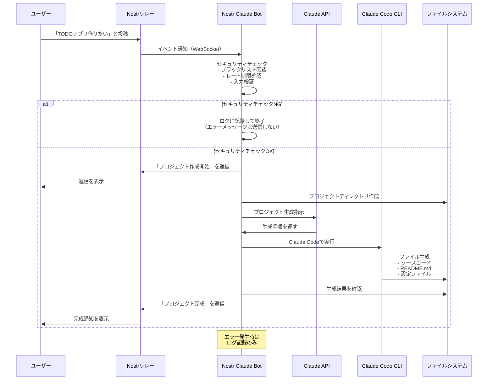

# Nostr Claude Bot

Nostrで「○○作りたい」と投稿すると、自動的にClaude Codeがプロジェクトを作成するbotです。

## 機能

- Nostrのリレーを監視し、「○○作りたい」パターンのメッセージを検出
- Claude APIを使用してプロジェクトの要件を分析
- Claude Codeを実行してプロジェクトを自動生成
- 生成結果をNostrで返信

## セットアップ

### 1. リポジトリのクローン
```bash
git clone https://github.com/yourusername/nostr-claude-bot.git
cd nostr-claude-bot
```

### 2. 依存関係のインストール
```bash
npm install
```

### 3. 環境変数の設定
`.env.example`を`.env`にコピーして必要な情報を設定：
```bash
cp .env.example .env
```

`.env`ファイルを編集：
```env
# Nostr Bot Configuration
NOSTR_PRIVATE_KEY=nsec1...  # あなたのNostrプライベートキー（nsec形式またはhex形式）

# Claude API Configuration
ANTHROPIC_API_KEY=sk-ant-...  # AnthropicのAPIキー

# Bot Configuration
BOT_NAME=NostrClaudeBot
NOSTR_RELAYS=wss://relay.damus.io,wss://relay.nostr.band,wss://nos.lol

# Project Generation Settings
PROJECT_BASE_PATH=./generated-projects
MAX_CONCURRENT_PROJECTS=3
```

### 4. Claude Codeのインストール
このbotはClaude Code CLIを使用するため、事前にインストールが必要です：
```bash
npm install -g @anthropic-ai/claude-code
```

## 使い方

### Botの起動
```bash
npm start
# または開発モード
npm run dev
```

### Nostrでの使用方法

1. **プロジェクト作成リクエスト**
   Nostrクライアント（Damus、Amethyst等）で以下のように投稿：
   ```
   TODOアプリ作りたい
   ```
   
2. **Botからの返信**
   Botが自動的に返信します：
   ```
   プロジェクト「TODOアプリ」を作成開始します！
   ```
   
3. **完成通知**
   プロジェクト生成が完了すると結果が返信されます：
   ```
   プロジェクト「TODOアプリ」の作成が完了しました！
   
   パス: ./generated-projects/TODOアプリ_2024-01-15T...
   
   プロジェクトが作成されました:
   ```

### 処理フロー図



### 対応するプロジェクトの例

- 「TODOアプリ作りたい」
- 「ゲーム作りたい」
- 「チャットボット作りたい」
- 「計算機作りたい」
- 「ブログシステム作りたい」
- 「API作りたい」

## Nostrアクセスの仕組み

### Botが行うNostrアクセスの種類

#### 1. リレーへの接続（WebSocket接続）
- **目的**: リアルタイムでメッセージを受信するため
- **接続先**: 環境変数で指定されたリレー（デフォルト: relay.damus.io, relay.nostr.band, nos.lol）
- **接続方法**: WebSocketプロトコルで常時接続を維持
- **負荷**: 最小限（通常のNostrクライアントと同等）

#### 2. メッセージの購読（Subscription）
- **購読内容**: 
  - kind: 1（通常のテキストノート）
  - since: Bot起動時からの新規メッセージのみ
- **フィルタリング**: 「○○作りたい」パターンのメッセージのみ処理
- **リレーへの負荷**: 最小限（フィルタはリレー側で処理）

#### 3. メッセージの送信（Publishing）
- **送信タイミング**:
  - プロジェクト作成開始時（「作成開始します」メッセージ）
  - プロジェクト完成時（結果通知メッセージ）
- **送信頻度**: 1リクエストあたり厳密に2メッセージのみ
- **メッセージサイズ**: 通常1KB以下
- **エラー時の動作**: エラーメッセージは送信せず、ログに記録のみ

### リレーへの配慮

#### 現在実装されている対策
1. **ユーザー単位のレート制限**: 1時間に10リクエストまで
2. **同時実行数の制限**: MAX_CONCURRENT_PROJECTS（デフォルト: 3）
3. **エラー時の自動ブロック**: 5回以上エラーが続くユーザーを遮断

#### リレーの負荷を最小化するベストプラクティス
1. **必要最小限のリレーに接続**: 使用するリレーを厳選
2. **効率的なフィルタリング**: クライアント側でなくリレー側でフィルタ
3. **適切なメッセージサイズ**: 長大なメッセージを避ける
4. **エラー時の再接続制御**: 無限ループを防ぐ

### Nostrプロトコルの使用方法

このBotは`nostr-tools`ライブラリを使用してNostrプロトコルを実装しています：

```javascript
// リレーへの接続
const pool = new SimplePool();
const sub = pool.subscribeMany(relays, filters);

// メッセージの送信
await pool.publish(relays, signedEvent);
```

## セキュリティ機能

### レート制限
- 1ユーザーあたり1時間に最大10リクエストまで
- 連続したエラーが5回以上でユーザーを自動ブロック

### 入力検証
- プロジェクト名は2-100文字まで
- 危険なキーワード（virus, malware等）は自動拒否
- 特殊文字やスクリプトインジェクションを防止

### 実行環境の隔離
- プロジェクトは専用ディレクトリに生成
- 実行時間は最大5分に制限
- メモリ使用量は10MBまで

## トラブルシューティング

### Botが反応しない場合
1. `.env`ファイルの設定を確認
2. Nostrプライベートキーが正しいか確認
3. リレーへの接続を確認
4. ログでエラーメッセージを確認

### プロジェクト生成が失敗する場合
1. Claude Code CLIがインストールされているか確認
2. Anthropic APIキーが有効か確認
3. ディスク容量が十分か確認
4. `generated-projects/`ディレクトリの権限を確認

### エラーメッセージの意味
- 「リクエストが多すぎます」: レート制限に達しています
- 「プロジェクトのアイデアが無効です」: 入力が短すぎるか禁止キーワードを含んでいます
- 「タイムアウトしました」: プロジェクト生成に5分以上かかりました

## 注意事項

- Claude Code CLIが必要です
- Anthropic APIの利用料金が発生します
- 生成されたプロジェクトは`generated-projects/`ディレクトリに保存されます
- プロジェクトの内容はClaude APIによって生成されるため、品質にばらつきがある可能性があります
- 生成されたコードは必ず確認してから使用してください

## ライセンス

MIT License