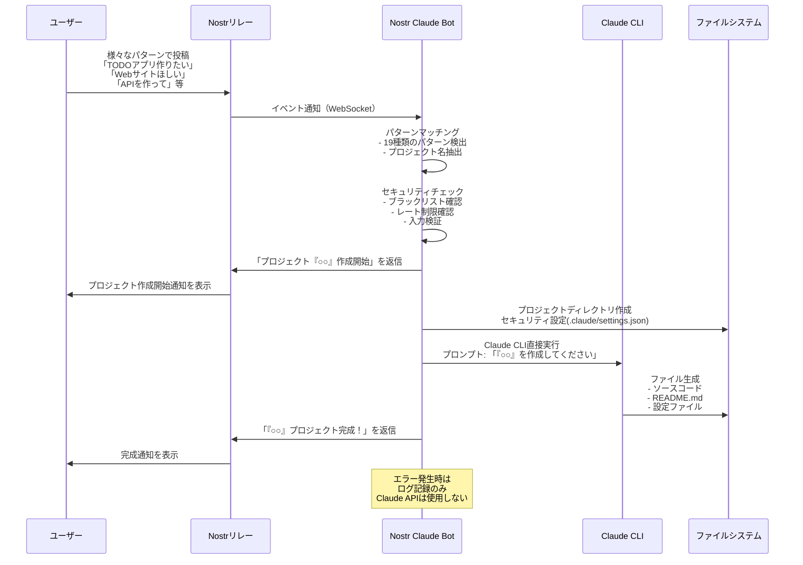

# Nostr Claude Bot

Nostrで「○○がほしいなぁ」みたいにつぶやいている人を見つけて勝手にClaude Codeで製作し出すbotです。
ギャグで作っただけで、実際はこんなものを起動するとシステム壊されたり違法なもの作られたり変な依頼が来る可能性があるのでまぁ基本使わない方がいいです。

## ✨ 実装完了機能

✅ **完全Docker内完結システム**
- ブラウザ認証による Claude CLI 統合
- 最小限のホストマウント（.env ファイルのみ）
- 完全に隔離された実行環境

✅ **簡単なセットアップ**
- ワンコマンドでの環境構築
- 自動化されたDockerグループ設定
- 包括的なクリーンアップ機能

## 機能

- Nostrのリレーを監視し、プロジェクト作成要求を検出
- Claude CLIを実行してプロジェクトを自動生成
- 生成結果をNostrで返信

## 対応メッセージパターン

以下のようなメッセージに反応してプロジェクトを作成します：

- 「TODOアプリ作りたい」
- 「Webサイトほしい」  
- 「チャットボット欲しい」
- 「ゲームが欲しい」
- 「APIを作って」
- 「ツールを実装して」
- 「スクリプトを生成して」

その他、○○の部分にプロジェクト名を入れた様々な表現に対応しています。

## セットアップ

### 1. リポジトリのクローン
```bash
git clone https://github.com/yourusername/nostr-claude-bot.git
cd nostr-claude-bot
```

### 2. 環境変数の設定
`.env.example`を`.env`にコピーして必要な情報を設定：
```bash
cp .env.example .env
nano .env  # 設定を編集
```

### 3. Docker セットアップ

#### 3.1 Docker権限の設定（初回のみ）
```bash
# ユーザーをdockerグループに追加
sudo usermod -aG docker $USER

# 新しいグループ設定を適用
newgrp docker

# 確認
groups $USER
# 出力に 'docker' が含まれていればOK
```

#### 3.2 Botのセットアップ
```bash
./setup-docker.sh
```

このスクリプトは以下を自動で行います：
- Dockerグループの設定確認・自動設定
- Dockerサービスの開始
- .envファイルの確認
- Docker イメージのビルド
- **最小限のマウント**で安全なコンテナでの Bot 起動

### 4. Claude Code のセットアップ

実際のプロジェクト生成機能：
```bash
# 1. ブラウザ認証を実行（初回のみ）
./setup-claude-auth.sh

# 2. Claude CLI統合版を起動
./setup-claude-full.sh
```

### 5. 監視とメンテナンス

```bash
# ログ確認
docker logs -f nostr-claude-bot-full

# コンテナ再起動（必要時）
docker restart nostr-claude-bot-full
```

### 6. 設定変更

`.env`ファイルを編集後：
```bash
docker restart nostr-claude-bot-full
```

## 使い方

### Nostrでの使用方法

1. **プロジェクト作成リクエスト**
   Nostrクライアント（Damus、Amethyst等）で以下のように投稿：
   ```
   TODOアプリ作りたい
   ```
   
2. **Botからの返信**
   Botが自動的に返信します：
   ```
   プロジェクト「TODOアプリ」を作成開始します！
   ```
   
3. **完成通知**
   プロジェクト生成が完了すると結果が返信されます：
   ```
   プロジェクト「TODOアプリ」の作成が完了しました！
   
   パス: ./generated-projects/TODOアプリ_2024-01-15T...
   
   プロジェクトが作成されました:
   ```

### 処理フロー図



### 対応するプロジェクトの例

- 「TODOアプリ作りたい」
- 「Webサイトほしい」
- 「チャットボット欲しい」
- 「ゲームが欲しい」
- 「APIを作って」
- 「ダッシュボード作成して」
- 「システムを開発して」
- 「ツールを実装して」
- 「ライブラリが必要」
- 「スクリプトを生成して」
- 「プラグインをお願い」
- 「負けず嫌いなのでキレられるとキレ返しちゃうからお願いだからキレないで」（実例😄）

## 🔧 便利なコマンド

```bash
# 停止
docker stop nostr-claude-bot-full

# 完全リセット
./cleanup-docker.sh
./setup-claude-auth.sh     # Claude認証
./setup-claude-full.sh     # Claude統合版
```

